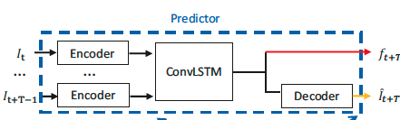

复现了基于预测进行视频异常检测的2018年论文**Future Frame Prediction for Anomaly Detection – A New Baseline**，FramePred。参考代码https://github.com/fjchange/pytorch_ano_pre

# Training command
`python train_pre.py --config configs/vad_pre.yaml --gpu 0`

使用unet作为生成器的主干网络需要将vad_pre.yaml内的generator设为unet，使用cyclegan中的生成器则设为cycle_generator。

使用flownet2作为光流网络需要将vad_pre.yaml内的flow_model设为flownet，使用liteflownet则设为liteflownet。

目前在单GPU上进行实验，在avenue数据集上能够达到88+的精度，而且这是在光流损失为0的情况下，加上光流损失或许能够逼近原论文作者后来在论文**Margin Learning Embedded Prediction for Video Anomaly Detection with A Few Anomalies**中使用**不同结构**复现的精度89.2。在ped2数据集上的精度不理想，大概为89多一点，原因应该在于原参考代码是在avenue上调的参数，在ped2上不适用。

目前这还是使用了参考代码中的unet结构作为生成器，如果换成原论文作者后来采用的结构精度或许会提高：

其中编码器和解码器采用Cycle-GAN的结构consisting of 3 convolution layers and 6 residual blocks，不对输入图像在通道维度上叠加，而是对每个视频帧图片单独进行编码，即将输入的N x T x c x h x w转换为(N x T) x c x h w。再将其转换为为N x T x c x h x w，输入到convlstm模块。

经过实验，换成后来采用的convlstm的结果确实提高了，经过400轮，精度最高为89.47
`python train_pre_convlstm.py --config configs/vad_pre.yaml --gpu 0`
